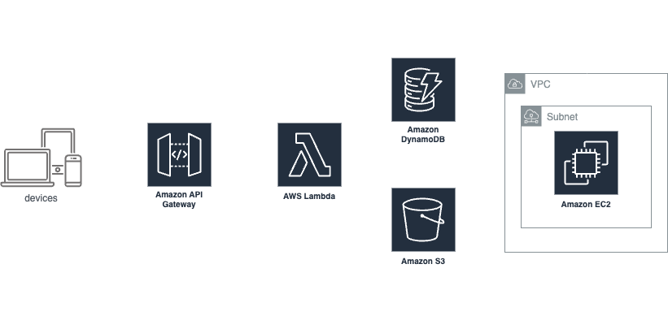

# AWS Automated File Processing System

This System is a cloud-based solution designed to provide a fully automated system for processing and storing user-submitted data (text and files). By utilizing AWS services such as S3, API Gateway, Lambda, DynamoDB, and EC2, this system minimizes manual intervention, optimizes resource usage, and ensures efficient data handling and processing. It automates resource provisioning and cleanup tasks, ensuring high performance, reliability, cost effectivness.

The system is designed to store uploaded files in S3 bucket, process them by  adjusting their content, and then stores the output file back in S3. While the core functionality focuses on simple file adjustments, it can be easily adapted to perform more complex tasks and computations. Examples of advanced processing tasks include:

- **Data Transformation**: Convert file formats (e.g., CSV to JSON), perform data cleaning, or aggregate data across multiple files.
- **Text Analysis**: Perform sentiment analysis, keyword extraction, or text summarization on text files.
- **Image Processing**: Apply filters, resize images, or convert between image formats (e.g., PNG to JPEG).
- **Machine Learning**: Use pre-trained models to make predictions, classify content, or detect anomalies in files.
- **Data Enrichment**: Integrate external data sources to enhance the content of uploaded files (e.g., adding geographic information to address data).
- **Complex Calculations**: Run simulations, compute statistical metrics, or analyze large datasets for insights.

## How It Works

1. **User Interaction**:
   - Users interact with the ReactJS web interface to input text and upload a file. After completing these actions, they click the submit button.

2. **Submission Process**:
   - **File Upload**: The system uploads the user’s file to an S3 bucket on AWS.
   - **Metadata Storage**: The text input and the S3 file path are sent to DynamoDB through a REST API built with API Gateway and Lambda. The DynamoDB table records the following:
     - `text_input`: The user’s submitted text
     - `s3_input_file_path`: The S3 path of the uploaded file, formatted as `s3://bucket-name/input/filename`

3. **Automated Processing**:
   - **Triggering EC2**: DynamoDB Streams monitor for new entries in the table. When a new entry is detected, a Lambda function triggers the creation of an EC2 instance.
   - **EC2 Processing Tasks**:
     1. **File Retrieval**: The EC2 instance downloads the input file from S3 using the path provided in DynamoDB (`s3_input_file_path`).
     2. **Script Download**: The EC2 instance retrieves a `script.py` file from S3. This script contains the necessary processing logic.
     3. **Script Execution**:
        - **Read Input File**: The script reads the input file.
        - **Calculate Text Length**: It calculates the length of the submitted text.
        - **Update File**: The script appends the length of the text to the content of the input file and saves it as a new file (`fileId.output`).
        - **Upload Output**: The new file is uploaded to S3, and its path is updated in DynamoDB to include:
          - `s3_output_file_path`: The S3 path of the processed file, formatted as `s3://bucket-name/output/filename`
        - **Terminate EC2**: The EC2 instance automatically terminates itself after completing these tasks.

## Features

- **User-Friendly Web Interface**: Developed with ReactJS, allowing users to input text and upload files easily.
- **Direct File Uploads**: Files are uploaded directly to Amazon S3, providing scalable and durable storage.
- **Automated Metadata Storage**: Stores metadata related to uploads and processing results in DynamoDB.
- **Dynamic Processing**: Utilizes EC2 instances for processing files automatically.
- **Scalable Resource Management**: Automatically provisions and terminates EC2 instances based on processing needs.
- **Efficient Data Handling**: Saves processed data back to S3 and updates metadata in DynamoDB.

## Architecture

1. **Frontend (ReactJS Web UI)**
   - **Text Input**: For users to submit text.
   - **File Input**: For users to upload files.
   - **Submit Button**: Initiates the processing workflow.

2. **File Storage**
   - Files are uploaded to an S3 bucket at the path `[BucketName]/[InputFile].Input`

3. **Metadata Storage**
   - DynamoDB table schema includes:
     - `Id`: Auto-generated ID via nanoid
     - `Input_text`: User-submitted text
     - `Input_file_path`: S3 path of the uploaded file
     - `Output_file_path`: S3 path of the processed output file (updated post-processing)

4. **Automated Processing**
   - A DynamoDB event triggers the creation of an EC2 instance.
   - A processing script is downloaded from S3 to the EC2 instance.
   - The script processes the input file and text, and the results are saved to S3.

5. **Resource Management**
   - EC2 instances are automatically terminated after processing.

## Technologies Used

- **Frontend**: ReactJS
- **Storage**: Amazon S3
- **Database**: Amazon DynamoDB
- **Compute**: Amazon EC2
- **Serverless**: AWS Lambda
- **API Management**: AWS API Gateway
<!-- - **Infrastructure as Code**: AWS CDK (or programmatic approach for uploading scripts to S3) -->

## Usage

1. Open the web application at [awsfileauto.netlify.app](https://awsfileauto.netlify.app/) in your browser.
2. Enter text into the text input field.
3. Select and upload a file using the file input field.
4. Click the submit button to initiate the processing.
5. The file will be uploaded to S3, metadata will be stored in DynamoDB, and processing will be triggered automatically.
6. Processed files will be available in S3, and metadata will be updated in DynamoDB.

